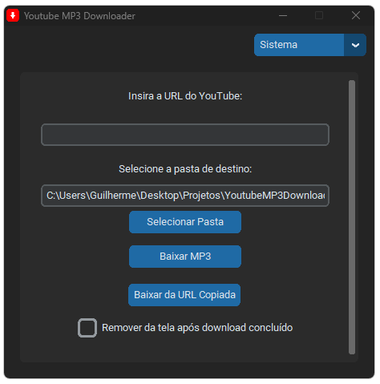

# 🎵 Youtube MP3 Downloader


Youtube MP3 Downloader é uma ferramenta simples para baixar áudios de vídeos do YouTube em formato MP3. Ele permite que você selecione uma pasta de destino, monitore o progresso do download e remova as informações após o download, se desejar.

## 📥 Downloads

Você pode baixar a última versão na seção de [Releases](https://github.com/guilhermecugler/YoutubeMP3Downloader/releases).

## 🖼️ Screenshot



## 🚀 Começando

Siga estas instruções para configurar e executar o projeto a partir do código fonte.

### 📋 Pré-requisitos

- Python 3.x
- `yt-dlp`
- `customtkinter`
- `pyperclip`

### 🔧 Instalação

1. Clone o repositório:
    ```bash
    git clone https://github.com/guilhermecugler/YoutubeMP3Downloader.git
    cd youtube-mp3-downloader
    ```

2. Instale as dependências:
    ```bash
    pip install -r requirements.txt
    ```

3. Baixe o `ffmpeg` e coloque na pasta do projeto:
    - [Baixar ffmpeg](https://github.com/yt-dlp/FFmpeg-Builds)

### 📦 Executando

1. Execute o script principal:
    ```bash
    python YoutubeMP3Downloader.py
    ```

### 📂 Estrutura do Projeto

```plaintext
youtube-mp3-downloader/
├── ffmpeg/                     # Pasta com executáveis do ffmpeg
├── YoutubeMP3Downloader.py     # Script principal
├── requirements.txt            # Dependências do projeto
└── README.md                   # Documentação do projeto
```
## 🛠️ Funcionalidades

- **Baixar áudio do YouTube**: Insira a URL do vídeo do YouTube e baixe o áudio em formato MP3.
- **Progresso do download**: Visualize o progresso do download.
- **Remover informações**: Opção para remover as informações do download após a conclusão.
- **Seleção de pasta de destino**: Escolha onde salvar os áudios baixados.

## 🤝 Contribuindo

Contribuições são bem-vindas! Sinta-se à vontade para abrir issues ou enviar pull requests.

1. Fork o projeto
2. Crie uma branch para sua feature (`git checkout -b feature/nova-feature`)
3. Commit suas alterações (`git commit -m 'Adiciona nova feature'`)
4. Push para a branch (`git push origin feature/nova-feature`)
5. Abra um Pull Request

## 📜 Licença

Este projeto está licenciado sob a Licença MIT - veja o arquivo [LICENSE](LICENSE) para mais detalhes.

---

Feito com ❤️ por [Guilherme Cugler](https://github.com/guilhermecugler)

